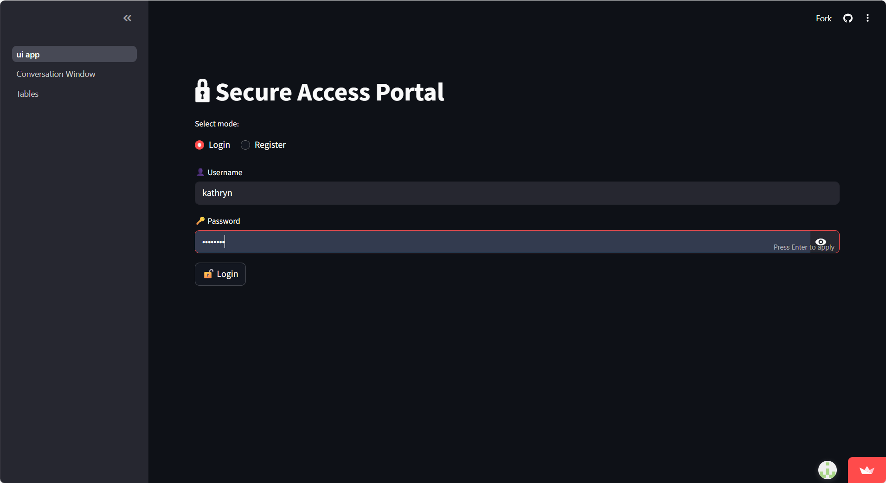
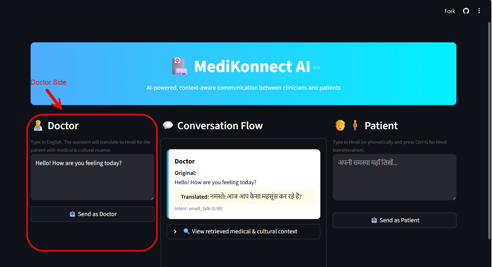
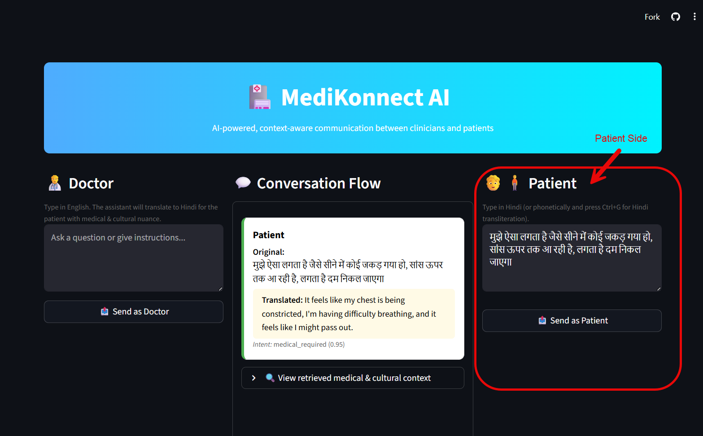
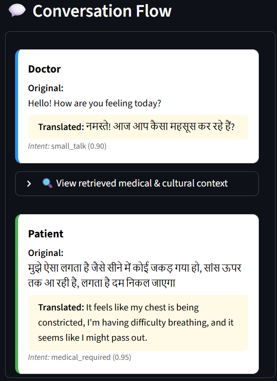
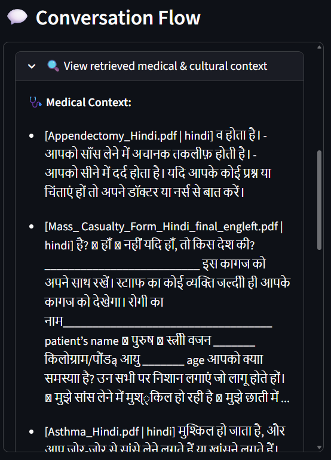
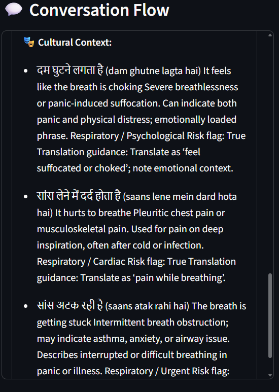
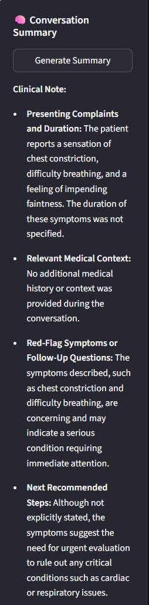
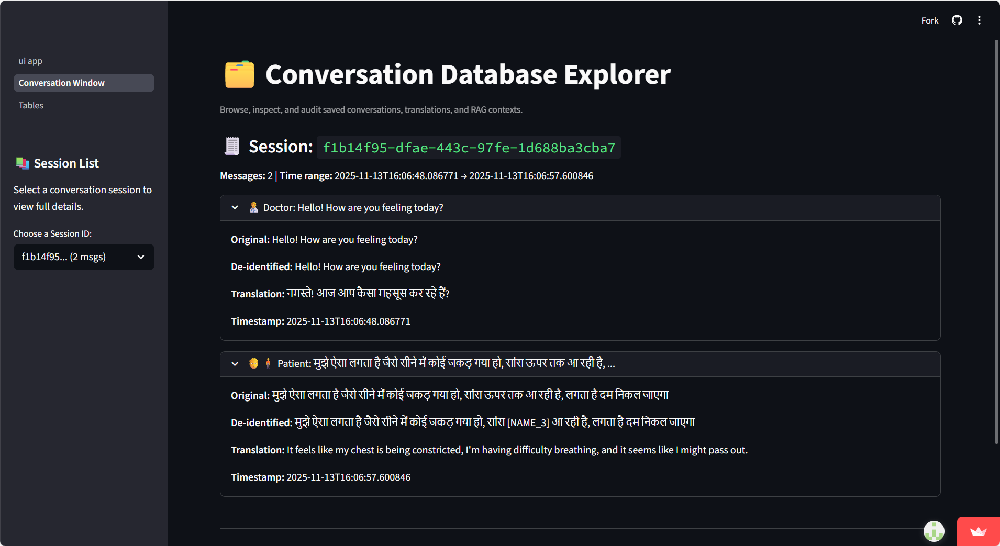
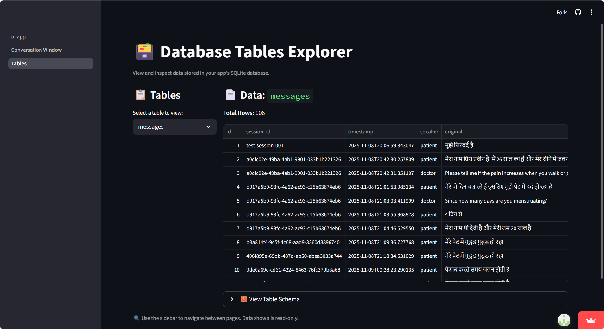

# 🏥 AI Multilingual Medical Interpreter (Agentic RAG System)

An **agentic, privacy-aware medical translation system** that bridges communication between doctors and patients in Hindi ↔ English, preserving **cultural semantics**, **medical context**, and **patient privacy**.  
Built with multi-agent coordination, retrieval-augmented generation (RAG), and reflection-based reasoning for adaptive and safe translation.

---

## 🚀 Key Features

- **Agentic Architecture (ReAct + Reflection):**  
  Coordinator, Translation, RAG, Intent, PII, and Security agents work together to ensure safe, contextually accurate communication.

- **Retrieval-Augmented Generation (RAG):**  
  Uses Pinecone vector database for semantic retrieval of relevant _medical_ and _cultural_ knowledge.

- **Cultural Semantics Preservation:**  
  Translates colloquial phrases (e.g., _“सिर फट रहा है” → “Severe headache”_) with correct clinical interpretation.

- **Privacy-Aware Processing (HIPAA-aligned):**  
  PII Agent masks sensitive information (names, phone numbers) before sending text to LLM.

- **Session Summarization & Persistent Memory:**  
  Stores key conversation summaries in SQLite for continuity across turns.

- **Adaptive Intent Detection:**  
  Automatically distinguishes between medical queries and small talk to reduce unnecessary RAG calls.

- **Streamlit UI:**  
  Interactive bilingual interface for real-time doctor–patient translation.

---

## 🖼️ Screenshots

### Login & Registration



### Doctor Side



### Patient Side



### Conversation Flow



## Medical Context of Patient Side Tile

From the translation of: मुझे ऐसा लगता है जैसे सीने में कोई जकड़ गया हो, सांस ऊपर तक आ रही है, लगता है दम निकल जाएगा


## Cultural Context of Patient Side Tile

From the translation of: मुझे ऐसा लगता है जैसे सीने में कोई जकड़ गया हो, सांस ऊपर तक आ रही है, लगता है दम निकल जाएगा


### Conversation Summary



### Conversation Window



### Tables



---

## ⚙️ Setup Instructions

### 1️⃣ Clone the repository

```bash
git clone https://github.com/<your-username>/ai-medical-translation-agentic-app.git
cd ai-medical-translation-agentic-app
```

### 2️⃣ Install dependencies

```bash
pip install -r requirements.txt
```

### 3️⃣ Configure environment variables

```bash
cp .env.example .env
```

Then open `.env` and add your API keys:

```
OPENAI_API_KEY=your_openai_api_key
PINECONE_API_KEY=your_pinecone_api_key
```

### 4️⃣ Initialize vector database (if using RAG)

```bash
python setup_db.py
```

### 5️⃣ Run the application

```bash
streamlit run app/ui_app.py
```

---

## 💡 How to Use

1. **Login or Register** in the Streamlit interface.
2. Choose your role — _Doctor (English)_ or _Patient (Hindi)_.
3. Type your message and send.
   - The app translates the text with _medical and cultural context_.
4. Use **“Generate Summary”** to view a session summary.
5. Explore conversation data via the **“Tables”** page.

---

## 👥 Team Member Contributions

### **Prince Praveen**

- Lead developer and primary architect of the backend multi-agent system.
- Implemented the ReAct-based translation engine, cultural semantics pipeline, and reflection module.
- Built and maintained the RAG integration, Pinecone vector index, and semantic retrieval workflow.
- Developed conversation routing, OpenAI API integration, and core orchestration logic across agents.
- Led debugging, optimization, and end-to-end system flow refinement.

### **Kathryn Burkhart**

- Designed and developed the Streamlit UI, including doctor and patient panels, translation flow display, and summary interface.
- Implemented PII masking, malicious intent detection, and privacy guardrails.
- Contributed to database setup, including ingestion into Pinecone (medical + cultural embeddings).
- Assisted with data processing, including preparation and cleaning of medical and cultural text sources for embedding.
- Authored system documentation, clinical note summarization template, and user guide content.
- Coordinated project direction, requirements alignment, and quality assurance.

### **Vrushabh Mudda**

- Participated in team meetings and provided feedback on documentation and design decisions.
- Assisted with reviewing system flow diagrams and ensuring consistency of terminology across components.

## 🧠 Technologies Used

| Category                | Tools / Models                                                     |
| ----------------------- | ------------------------------------------------------------------ |
| **LLM Models**          | OpenAI GPT-4o (for translation, reasoning, reflection)             |
| **Embeddings**          | `text-embedding-3-large` (1536-D)                                  |
| **Vector Database**     | Pinecone (cosine similarity search)                                |
| **Language Processing** | spaCy (NER, regex-based PII masking)                               |
| **Frontend**            | Streamlit (multi-page interface, session management)               |
| **Backend / DB**        | SQLite (conversation memory, summaries)                            |
| **Architecture**        | Multi-Agent (Coordinator, Intent, Translation, RAG, PII, Security) |

---

## ⚠️ Known Limitations

- Currently supports only **Hindi ↔ English** translation.
- Limited PII detection (only names and phone numbers).
- Dependent on **OpenAI API connectivity** and Pinecone rate limits.
- No speech input/output (text-only interface).
- Evaluation metrics (BLEU/COMET) not yet integrated.

---

## 🔮 Future Improvements

- Expand to **more Indian languages** (Tamil, Bengali, Marathi, Telugu).
- Add **speech-to-text (Whisper)** and **text-to-speech (Azure TTS)** for full voice-based interaction.
- Integrate **UMLS/SNOMED-CT mapping** for structured clinical documentation.
- Implement **differential privacy and transformer-based de-identification**.
- Deploy as **Dockerized microservices** for local hospital use.
- Add **explainability dashboard** to visualize agent reasoning and RAG retrieval traces.

---

**📌 Demo Note:**

> This prototype is for **research and educational purposes** only.  
> It should not be used for actual clinical diagnosis or treatment without licensed medical supervision.